About Me
-------

Hello, my name is AureumApes and I'm a self-thaught, hobby- Backend Developer from Germany.
In love with Go and Esoteric Languages.

Contact me
---------------------

Tools and Languages I use
----------
| Type| Tech |
|  --  | --|
| OS |   |
| Languages |     |
| Other Technologies |    |
Metrics
-------
 

